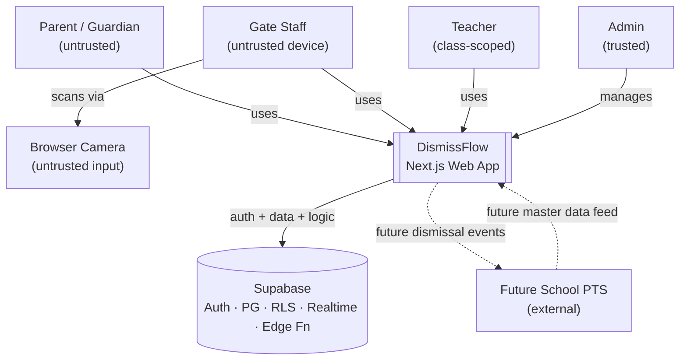
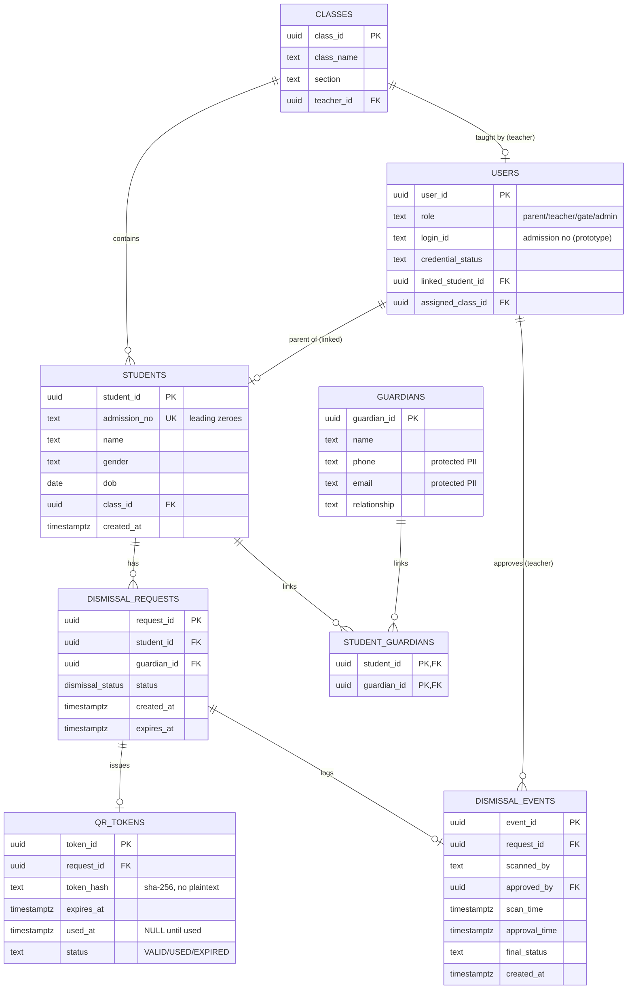
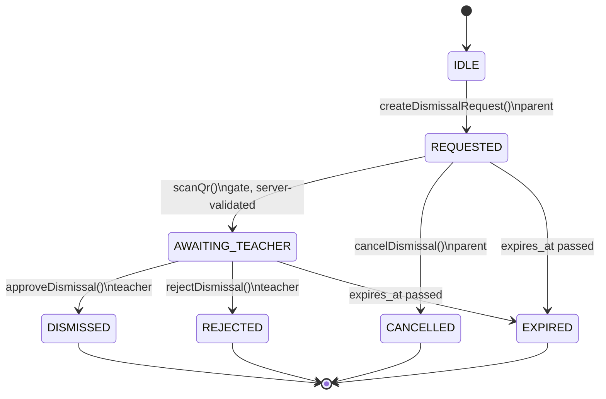
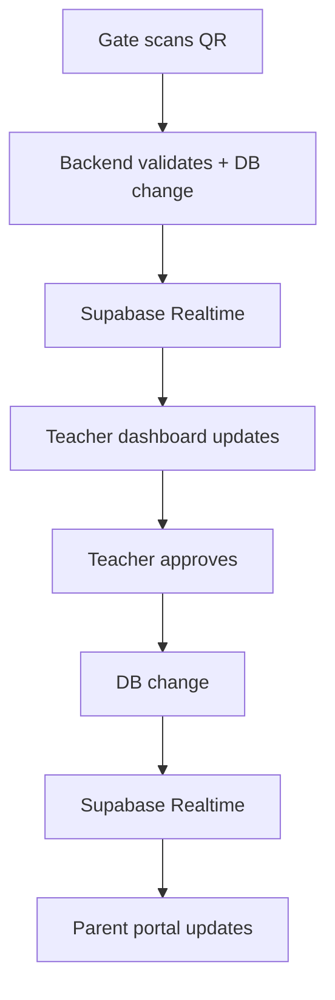
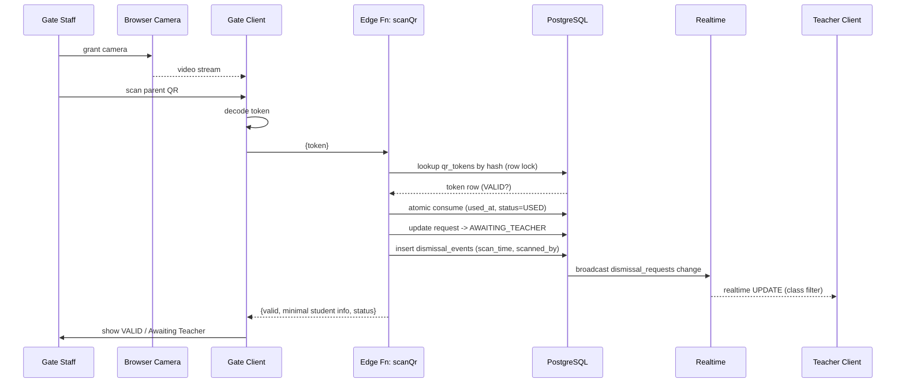
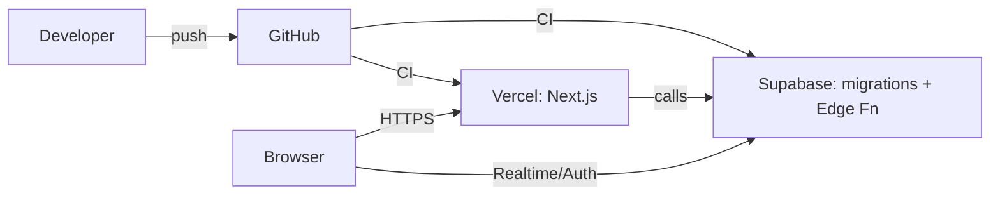
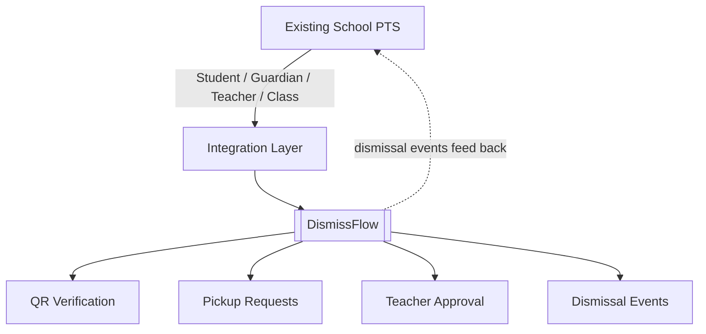

# DismissFlow EPS — Architecture

> **Document Status: Implemented as of 2026-08-27**
>
> The DismissFlow EPS repository is no longer greenfield. The database
> schema, RLS policies, Edge Functions, and all four portals (parent,
> gate, teacher, admin) are committed and operational. The Next.js app
> is wired to the Supabase backend; the QR lifecycle, atomic single-use
> consume, role-scoped authorization, and immutable audit trail are
> enforced by the server. This document continues to be the source of
> truth for *how* the system is built; the live status is reflected in
> the table at the top of `README.md`.
>
> Components introduced after the original greenfield blueprint are
> marked `Implemented` below. Any component still marked `Planned` is
> either a Phase 7+ item or explicitly out of prototype scope.

---

## Conventions Used in This Document

| Label | Meaning |
| ----- | ------- |
| `Implemented` | Exists in the repository today. |
| `Planned` | Required by the PRD but **not yet implemented** in the repository. |
| `Future` | Post-prototype evolution (PRD §30). Not required for the prototype. |
| `PRD §N` | Citation to the product requirements document. |

Because no application code exists yet, **no actual source file paths can be cited**. Section 17 therefore presents the *actual* repository tree (two entries) and the *planned* Next.js + Supabase tree that the implementation should adopt. All planned paths are prefixed `Planned:`.

---

## Table of Contents

1. [Architecture Overview](#1-architecture-overview)
2. [System Context](#2-system-context)
3. [Application Architecture](#3-application-architecture)
4. [Portal Architecture](#4-portal-architecture)
5. [Backend Architecture](#5-backend-architecture)
6. [Database Architecture](#6-database-architecture)
7. [Dismissal State Machine](#7-dismissal-state-machine)
8. [QR Security Architecture](#8-qr-security-architecture)
9. [Authentication & Authorization](#9-authentication--authorization)
10. [Realtime Architecture](#10-realtime-architecture)
11. [API / Server Operations](#11-api--server-operations)
12. [Security Architecture](#12-security-architecture)
13. [Audit & Observability](#13-audit--observability)
14. [Error Handling](#14-error-handling)
15. [Data Flow](#15-data-flow)
16. [Deployment Architecture](#16-deployment-architecture)
17. [Repository Architecture](#17-repository-architecture)
18. [Security & Privacy Boundaries](#18-security--privacy-boundaries)
19. [Architectural Decisions](#19-architectural-decisions)
20. [Current vs Planned Architecture](#20-current-vs-planned-architecture)
21. [PTS Integration Architecture](#21-pts-integration-architecture)
22. [Scalability Considerations](#22-scalability-considerations)
23. [Architecture Risks & Tradeoffs](#23-architecture-risks--tradeoffs)
24. [Architecture Summary](#24-architecture-summary)

---

## 1. Architecture Overview

### 1.1 What DismissFlow Is

DismissFlow is a **web-based student pickup and dismissal system** that replaces manual, card-based dismissal with a secure digital chain:

**Parent Request → QR Verification → Teacher Confirmation → Dismissed**  (`PRD §3`)

The product connects three role-specific web experiences — **Parent Portal**, **Gate/Scanner Portal**, **Teacher Portal** — plus an **Admin** capability for prototype management, all backed by a single realtime Supabase system (`PRD §1`, `PRD §34`).

### 1.2 Architecture Philosophy

The architecture is defined by six principles (`PRD §32`):

- **Web-first** — one responsive web app, no app installation, no native client for the prototype (`PRD §7`).
- **Supabase-backed** — Auth, PostgreSQL, RLS, Realtime, and Edge Functions are the entire backend; there is no separate Node server (`PRD §34`).
- **Realtime-first** — state propagates via Supabase Realtime; the product explicitly forbids polling, periodic refresh, or manual reload (`PRD §18`, `PRD §25`).
- **Server authority** — the client is never the authority for QR validity, authorization, state transitions, single-use enforcement, expiry, or audit logging (`PRD §21`).
- **Minimal disclosure** — the gate sees only the minimum verification information; guardian/student PII is never placed in the QR (`PRD §21`).
- **Integratable** — data structures are designed so the system can later become a module inside an existing school PTS rather than a replacement (`PRD §31`).

### 1.3 High-Level Architecture

```mermaid
graph TD
    subgraph Browser["Browser (responsive web app)"]
        P[Parent Portal]
        G[Gate / Scanner Portal]
        T[Teacher Portal]
        A[Admin Portal]
        NEXT["Next.js + TypeScript<br/>Tailwind + shadcn/ui"]
    end

    subgraph Supabase["Supabase Backend"]
        AUTH["Supabase Auth"]
        PG[("PostgreSQL")]
        RLS["Row Level Security"]
        RT["Supabase Realtime"]
        EF["Edge Functions<br/>(server-side trusted logic)"]
    end

    P --> NEXT
    G --> NEXT
    T --> NEXT
    A --> NEXT

    NEXT -->|session / RLS reads| AUTH
    NEXT -->|queries (RLS-filtered)| PG
    NEXT -->|postgres_changes| RT
    NEXT -->|invoke| EF
    EF -->|validated writes| PG
    EF -->|enforced by| RLS
    RT -->|driven by DB changes| PG
```

The diagram above is the implemented architecture (`PRD §9`). The four
portals on the left and the Edge Functions on the right are all
`Implemented` in the repository (see `README.md` status table).

---

## 2. System Context

### 2.1 Actors and Systems

| Actor / System | Responsibility | Trust Boundary |
| -------------- | -------------- | -------------- |
| **Parent / Guardian** | Requests pickup for their linked child, displays the QR, observes dismissal status. | Untrusted client. Authenticated only via demo admission-number credential in the prototype (`PRD §12`). |
| **Gate Staff** | Authenticates the gate device/session, scans the parent QR with a browser camera, and sees **minimum** verification info. | Untrusted client operating a shared device. Must never decide QR validity (`PRD §15`, `PRD §21`). |
| **Teacher** | Views the realtime pickup queue for their assigned class, inspects request details, and makes the **final** approve/reject decision. | Authenticated, partially trusted (final human authority) but still constrained by RLS to their class (`PRD §16`, `PRD §17`). |
| **Admin** | Prototype management: import roster, assign students to class/teacher, review dismissal logs. | Trusted administrative role; broad RLS scope (`PRD §6`). |
| **DismissFlow (app)** | The Next.js responsive web app delivering the four role experiences. | Application code; not a trust authority on its own. |
| **Supabase** | Auth, PostgreSQL, RLS, Realtime, Edge Functions. The trusted backend. | **Trusted boundary.** All authoritative validation happens here. |
| **Browser Camera** | Captures the QR image client-side for decoding into a token string. | Untrusted input source; only the decoded token leaves the device, and only the server validates it. |
| **Future School PTS** | Existing student/guardian/teacher/class system. Feeds master data; consumes dismissal events (`PRD §31`). | External trusted system; integration is `Future`. |

### 2.2 System-Context Diagram



---

## 3. Application Architecture

> **Status:** `Implemented`. The Next.js App Router application is committed
> under `app/`. The structure follows the PRD's stack (`PRD §8`, `PRD §34`)
> and the Revora / Kernel motion design system in `Docs/design/README.md`.

### 3.1 Framework and Structure

- **Next.js (App Router) + TypeScript** as the single responsive web application (`PRD §8`).
- **Tailwind CSS + shadcn/ui** for the design system and accessible components (`PRD §8`).
- Role-based experiences delivered as **route groups** rather than separate apps, sharing one layout, one Supabase client, and one design system (`PRD §7`).

Planned route layout (`Planned:`):

```
app/
  layout.tsx                 # root layout, fonts, Toaster, Realtime provider
  globals.css               # Tailwind + shadcn theme tokens
  page.tsx                  # landing / role selection
  (auth)/
    login/page.tsx          # parent + teacher + admin login
    gate-login/page.tsx     # gate device/session login
  parent/
    layout.tsx              # auth guard: role = parent
    page.tsx                # dashboard + Request Dismissal
    history/page.tsx        # dismissal history
  gate/
    layout.tsx              # auth guard: role = gate
    page.tsx                # camera scanner + scan result
  teacher/
    layout.tsx              # auth guard: role = teacher
    page.tsx                # realtime pickup queue (assigned class)
    [requestId]/page.tsx    # pickup detail + approve/reject
  admin/
    layout.tsx              # auth guard: role = admin
    page.tsx                # overview
    roster/page.tsx         # student/class roster
    logs/page.tsx           # dismissal logs (audit)
```

### 3.2 Routing and Layouts

- **Route groups** `(auth)` keep auth screens outside the role-guarded shell.
- Each role folder has a `layout.tsx` that enforces the session and the expected `role` claim; an unauthorized role is redirected (`PRD §9` auth model).
- The root `layout.tsx` mounts a **Realtime provider** and a connection-status indicator (`PRD §25`).

### 3.3 State Management

- **No heavy global store is required for the prototype.** Local component state plus React Query-style data fetching (or plain `useEffect` + Supabase subscriptions) is sufficient.
- **Realtime is the source of truth for live data** — portals subscribe to database changes rather than holding their own polling timers (`PRD §18`).

### 3.4 Data Fetching and Supabase Client

Planned client modules (`Planned:`):

```
lib/
  supabase/
    client.ts        # browser client (anon key, NEXT_PUBLIC_*)
    server.ts        # server client for RSC / route handlers
    middleware.ts    # session refresh middleware
  auth/session.ts    # getCurrentUser(), requireRole()
  qr/generate.ts     # render QR from token (UI only)
  qr/scan.ts         # camera decode -> token string
  realtime/subs.ts   # typed subscription helpers + status
```

- The **browser client** uses the anon key and is always constrained by RLS. It never holds the service-role key.
- **Authoritative writes** (request creation, QR validation, approval) go through **Edge Functions** invoked from the client, so the server — not the browser — owns validation and state transitions (`PRD §20`).

### 3.5 Realtime Subscriptions

- Subscriptions are established after authentication inside each portal's layout/provider.
- Lifecycle: subscribe on mount, unsubscribe on unmount, surface channel state to the UI (`PRD §25`).
- Filtering is performed server-side via RLS + Postgres `WHERE` on the change payload, so a portal only receives rows it is allowed to see.

### 3.6 Error and Loading States

- Every async action renders explicit **loading** and **error** states (shadcn `Spinner`, `Alert`, `Toast`).
- Realtime disconnection is shown as `⚠ Reconnecting...` and the UI never silently reports success while disconnected (`PRD §25`).

---

## 4. Portal Architecture

All four portals are `Implemented`. Each ships a `layout.tsx` role guard
and a primary page that consumes the realtime subscription helpers in
`lib/realtime/subs.ts`. The portals are specified against the PRD below.

### 4.1 Parent Portal

- **Authentication** — `Planned:` demo admission-number login (`PRD §12`, `PRD §13`). The admission number is both the identifier and the temporary password (demo-only).
- **Linked student lookup** — on login, the app resolves the `users.linked_student_id` to display the child's name, class, and admission number (`PRD §13`).
- **Dismissal request creation** — the `Request Dismissal` action invokes `createDismissalRequest()` (`Planned:` Edge Function). The server checks authorization, rejects if an active request already exists, creates the request, and returns a single-use token + expiry (`PRD §13`).
- **QR generation/display** — the client renders a QR encoding **only the random token**. A live countdown shows `Expires in 01:42` (`PRD §14`).
- **Request state** — the dashboard reflects the live `status` of the request, updated via Realtime.
- **Realtime status updates** — when the teacher approves, the parent's portal flips to `✓ DISMISSED` without refresh (`PRD §18`, `PRD §26`).
- **Dismissal history** — `Planned:` `parent/history/page.tsx` lists past dismissals for the linked student.

### 4.2 Gate Portal

- **Gate authentication/session** — `Planned:` a controlled gate account/session or PIN (`PRD §12`, `PRD §15`). The route is `/gate` (`PRD §15`).
- **Camera access** — the browser requests camera permission; denial is a handled error state (`PRD §24`).
- **QR scanning** — `Planned:` browser camera + QR decoder reads the token string from the QR (`PRD §8` QR strategy).
- **Server-side QR validation** — the decoded token is sent to `scanQr()` (`Planned:` Edge Function). The **server** validates hash, expiry, and single-use and performs the state transition (`PRD §20`, `PRD §21`). The client never decides validity.
- **Minimal student information** — on success the gate sees only `Student: Aarav / Class: Tulip / Status: Awaiting Teacher` (`PRD §15`). No guardian PII, no contact data.
- **Transition to teacher verification** — a valid scan moves the request to `AWAITING_TEACHER`, triggering the teacher realtime update (`PRD §18`).

### 4.3 Teacher Portal

- **Teacher authentication** — `Planned:` a seeded teacher Supabase Auth account (`PRD §12`).
- **Assigned class access** — the teacher's `users.assigned_class_id` scopes every query and realtime subscription to their class (`PRD §6`, `PRD §16`).
- **Realtime pickup queue** — `Planned:` `teacher/page.tsx` lists pending pickups and updates automatically when the gate scans (`PRD §16`, `PRD §18`). No refresh button.
- **Request details** — `Planned:` `teacher/[requestId]/page.tsx` shows student name, admission number, class, request time, scan time, and the necessary guardian verification info (`PRD §17`).
- **Approve / Reject** — actions invoke `approveDismissal()` / `rejectDismissal()` (`Planned:` Edge Functions). The teacher remains the **final authority**; a QR alone never authorizes release (`PRD §17`, `PRD §21`).
- **Manual verification** — `Planned:` a `MANUAL VERIFICATION` action for edge cases where the teacher confirms identity without/before a scan event (`PRD §17`).
- **Dismissal history** — visible within the teacher's class scope.

### 4.4 Admin

Only the capabilities explicitly in the PRD are planned (`PRD §6`):

- **Import roster** — ingest the 18-student Nursery/Tulip roster (admission numbers as strings to preserve leading zeroes; `PRD §11`).
- **View students** — read student records.
- **Assign students to class/teacher** — maintain `classes.teacher_id` and `students.class_id`.
- **Review dismissal logs** — read `dismissal_events` audit records.

No other admin capabilities are assumed.

---

## 5. Backend Architecture

> **Status:** `Implemented`. The entire backend is the Supabase project
> specified by the PRD's Final Technology Decision (`PRD §34`). The
> schema is in `supabase/migrations/`, the server logic in
> `supabase/functions/`, and the RLS policies in `0001_init.sql`.

Supabase provides the complete backend:

| Capability | Supabase Component | Role in DismissFlow |
| ---------- | ------------------ | ------------------- |
| Authentication | **Supabase Auth** | Issues JWTs for parent/teacher/gate/admin (`PRD §8`, `PRD §12`). |
| Relational storage | **PostgreSQL** | Students, guardians, classes, users, requests, tokens, events (`PRD §10`). |
| Authorization | **Row Level Security (RLS)** | Enforces per-role row visibility on every direct query (`PRD §8`, `PRD §21`). |
| Realtime | **Supabase Realtime** | Pushes DB changes to portals without polling (`PRD §18`). |
| Server logic | **Edge Functions** | The only place QR validation, state transitions, single-use/expiry enforcement, and audit logging occur (`PRD §20`). |

### 5.1 Client-Side vs Server-Side Trusted Logic

This is the central architectural rule (`PRD §20`, `PRD §21`):

**Client-side logic (untrusted, never authoritative):**
- Rendering the QR from a token it was given.
- Decoding a scanned QR into a token string.
- Sending tokens/actions to the server.
- Displaying realtime updates.

**Server-side trusted logic (the authority):**
- QR validation (hash match, expiry, single-use).
- Authorization checks (role, class scope, link scope).
- State transitions (`REQUESTED → AWAITING_TEACHER → DISMISSED`, etc.).
- Single-use enforcement (atomic token consumption).
- Expiry enforcement.
- Audit logging (`dismissal_events`).

The client **must never** be the authority for: QR validity, authorization, dismissal approval, state transitions, single-use enforcement, expiry enforcement, or audit logging (`PRD §21`).

### 5.2 Database Triggers / Functions

`Planned:` Server-side database functions/triggers may assist with:
- Enforcing the **one active request per student** invariant (partial unique index; see §6).
- Recording `dismissal_events` rows as part of state transitions inside Edge Functions.
No triggers are assumed to exist; the authoritative logic lives in Edge Functions.

---

## 6. Database Architecture

> **Status:** `Implemented`. The schema is in `supabase/migrations/0001_init.sql`
> and subsequent migrations. The tables below are the live implementation,
> not a target.

### 6.1 Tables (Implemented)

> Column types match the live implementation in
> `supabase/migrations/0001_init.sql`. `admission_no` is `TEXT` so leading
> zeroes such as `040` are preserved (`PRD §11`).

#### `students`  (`Implemented`)
| Column | Type | Notes |
| ------ | ---- | ----- |
| `student_id` | `uuid` PK | |
| `admission_no` | `text` UNIQUE NOT NULL | string; leading zeroes preserved (`PRD §11`) |
| `name` | `text` | |
| `gender` | `text` | |
| `dob` | `date` | |
| `class_id` | `uuid` FK → `classes.class_id` | |
| `created_at` | `timestamptz` | |

**RLS:** readable by authenticated roles; guardian PII is **not** stored on this table.

#### `guardians`  (`Planned`)
| Column | Type | Notes |
| ------ | ---- | ----- |
| `guardian_id` | `uuid` PK | |
| `name` | `text` | |
| `phone` | `text` | **protected PII** |
| `email` | `text` | **protected PII** |
| `relationship` | `text` | |

**RLS:** selectable **only** by the linked parent, the teacher of the student's class, and admin. Never by the gate role.

#### `student_guardians`  (`Planned`) — junction
| Column | Type | Notes |
| ------ | ---- | ----- |
| `student_id` | `uuid` FK → `students.student_id` | PK part |
| `guardian_id` | `uuid` FK → `guardians.guardian_id` | PK part |

**RLS:** mirrors `guardians` access.

#### `classes`  (`Planned`)
| Column | Type | Notes |
| ------ | ---- | ----- |
| `class_id` | `uuid` PK | |
| `class_name` | `text` | e.g., `Nursery`, `Tulip` |
| `section` | `text` | |
| `teacher_id` | `uuid` FK → `users.user_id` | |

#### `users`  (`Planned`)
| Column | Type | Notes |
| ------ | ---- | ----- |
| `user_id` | `uuid` PK | references `auth.users` |
| `role` | `text` | `parent` \| `teacher` \| `gate` \| `admin` |
| `login_id` | `text` | admission number for parent prototype (`PRD §12`) |
| `credential_status` | `text` | |
| `linked_student_id` | `uuid` FK → `students.student_id` | parent only |
| `assigned_class_id` | `uuid` FK → `classes.class_id` | teacher only |

#### `dismissal_requests`  (`Planned`)
| Column | Type | Notes |
| ------ | ---- | ----- |
| `request_id` | `uuid` PK | |
| `student_id` | `uuid` FK → `students.student_id` | |
| `guardian_id` | `uuid` FK → `guardians.guardian_id` | nullable |
| `status` | `dismissal_status` | enum (see §7) |
| `created_at` | `timestamptz` | |
| `expires_at` | `timestamptz` | request/QR expiry window (2–5 min; `PRD §14`) |

**Constraints:**
- **Partial unique index** enforcing exactly one *active* request per student:
  `UNIQUE (student_id) WHERE status IN ('REQUESTED','AWAITING_TEACHER')` (`PRD §13`).
- **Check constraint** on `status` against the `dismissal_status` enum.

**RLS:** parent sees own linked student's requests; teacher sees requests for students in their class; gate has **no direct select** (it receives minimal info only via the `scanQr` Edge Function result); admin sees all.

#### `qr_tokens`  (`Planned`)
| Column | Type | Notes |
| ------ | ---- | ----- |
| `token_id` | `uuid` PK | |
| `request_id` | `uuid` FK → `dismissal_requests.request_id` | |
| `token_hash` | `text` | **hash of** the random token; plaintext never stored |
| `expires_at` | `timestamptz` | |
| `used_at` | `timestamptz` | NULL until consumed |
| `status` | `text` | `VALID` \| `USED` \| `EXPIRED` |

**RLS:** **no client select policy.** The token value exists only in the QR shown to the parent and is validated inside the Edge Function. The table is server-only.

#### `dismissal_events`  (`Planned`) — audit
| Column | Type | Notes |
| ------ | ---- | ----- |
| `event_id` | `uuid` PK | |
| `request_id` | `uuid` FK → `dismissal_requests.request_id` | |
| `scanned_by` | `text` | gate id / device (`PRD §22`) |
| `approved_by` | `uuid` | teacher `user_id`, nullable |
| `scan_time` | `timestamptz` | nullable |
| `approval_time` | `timestamptz` | nullable |
| `final_status` | `text` | |
| `created_at` | `timestamptz` | |

**RLS:** admin + teacher (of class) + gate (own scans) may read; **no UPDATE/DELETE policies** → immutable audit.

### 6.2 Relationships (ER Diagram)



### 6.3 Indexes (Planned)

- `dismissal_requests(student_id, status)` — supports the active-request check and teacher-class queue.
- `qr_tokens(token_hash)` — O(1) lookup during validation.
- `dismissal_events(request_id)` — audit lookups.
- `users(role, assigned_class_id)`, `users(login_id)` — auth/role scoping.

---

## 7. Dismissal State Machine

### 7.1 States

`dismissal_status` enum (`Planned`), taken verbatim from `PRD §19`:

`IDLE` · `REQUESTED` · `AWAITING_TEACHER` · `DISMISSED` · `REJECTED` · `EXPIRED` · `CANCELLED`

> **Note on simplifying the persisted state machine:** The PRD enumerates additional states (`SCANNED`, `APPROVED`). For a two-person prototype, the persisted request status keeps only the steady states a portal needs to render: a valid gate scan is captured as an **event** in `dismissal_events.scan_time`, and teacher approval transitions directly to the final `DISMISSED` state (the approval moment is captured as `dismissal_events.approval_time`). This collapses the state machine to a small, unambiguous set without losing any information from the audit log.

### 7.2 Transitions

| From | To | Trigger | Backend operation | Validation | Realtime event |
| ---- | -- | ------- | ----------------- | ---------- | ------------- |
| IDLE | REQUESTED | Parent requests pickup | `createDismissalRequest()` | role=parent, linked student, no active request | — |
| REQUESTED | AWAITING_TEACHER | Gate scans valid QR | `scanQr()` | token hash valid, not expired, not used | `dismissal_requests` UPDATE → teacher |
| AWAITING_TEACHER | DISMISSED | Teacher approves | `approveDismissal()` | role=teacher, owns class | `dismissal_requests` UPDATE → parent |
| AWAITING_TEACHER | REJECTED | Teacher rejects | `rejectDismissal()` | role=teacher, owns class | UPDATE → parent + audit |
| REQUESTED | CANCELLED | Parent cancels | `cancelDismissal()` | role=parent, owns request | UPDATE → (none) |
| REQUESTED / AWAITING_TEACHER | EXPIRED | `expires_at` passed | token/request expiry check | server-side time check | UPDATE (audit) |

### 7.3 State Diagram



### 7.4 Failure Behavior

- An invalid/expired/used token → `scanQr()` returns an error; **no state change**, gate shows `✕ INVALID QR` (`PRD §15`, `PRD §24`).
- A concurrent approval race → the `→ DISMISSED` update is guarded by an idempotent status check on the current row, so the second writer fails; the loser sees "already processed" (`PRD §24` teacher).

---

## 8. QR Security Architecture

This is the most security-critical section (`PRD §14`, `PRD §21`).

### 8.1 QR Lifecycle

```mermaid
flowchart LR
    A[Parent requests dismissal] --> B[Server creates request]
    B --> C[Generate random non-guessable token]
    C --> D[Hash token; store token_hash]
    D --> E[QR displays token to parent]
    E --> F[Gate scans QR -> sends token]
    F --> G[Server validates token]
    G --> H[Check expiry]
    H --> I[Check single-use status]
    I --> J[Atomically consume token]
    J --> K[Move request to teacher verification]
```



### 8.2 Token Generation (`Planned`)

- Generated **server-side** inside `createDismissalRequest()` using a cryptographically secure RNG (e.g., `crypto.randomBytes(32)` → hex/URL-safe). **Never** client-generated.
- High entropy (≥128 bits) so it is non-guessable (`PRD §14`).

### 8.3 Token Storage (`Planned`)

- The **plaintext token is returned once** to the parent client to render the QR.
- The database stores only `qr_tokens.token_hash` (e.g., SHA-256). The plaintext is never persisted, so a DB leak does not reveal usable tokens.
- `expires_at` set to now + 2–5 minutes (`PRD §14`).

### 8.4 Expiry (`Planned`)

- `scanQr()` rejects tokens where `expires_at < now()` → `EXPIRED` (`PRD §24`).
- Expiry is enforced **server-side**; the client countdown is informational only.

### 8.5 Single-Use Enforcement & Replay Protection (`Planned`)

- `scanQr()` performs an **atomic consume**: `UPDATE qr_tokens SET used_at = now(), status='USED' WHERE token_id = $1 AND used_at IS NULL AND expires_at > now()` returning the row.
- If zero rows are affected, the token is **already used or expired** → reject. This gives replay protection and duplicate-scan protection in one atomic step (`PRD §21`).

### 8.6 What Is Encoded in the QR

- **Only the random token string.** Nothing else.

### 8.7 What Is Intentionally NOT Encoded (`PRD §14`, `PRD §21`)

The QR payload **never** contains:
- phone number
- email
- guardian information
- sensitive student information (name/class may be revealed to the gate only via the *server's* scan result, not from the QR itself)

The token is an opaque reference; all PII is resolved server-side and disclosed on a need-to-know basis (gate sees minimal info; `PRD §15`).

---

## 9. Authentication & Authorization

### 9.1 Authentication (`Planned`)

| Role | Implementation (PRD §12) | Status |
| ---- | ------------------------ | ------ |
| **Parent** | Demo credential: admission number used as **both** login identifier and temporary password. Explicitly a **demo-only shortcut**. | `Planned` (prototype-only) |
| **Teacher** | Seeded Supabase Auth account. | `Planned` |
| **Gate** | Controlled gate account/session or PIN; the `/gate` device is shared. | `Planned` |
| **Admin** | Seeded Supabase Auth admin account. | `Planned` |

> Production authentication (`Planned`/`Future`) should use secure passwords, OTP, passkeys, or the school IdP (`PRD §12`). The prototype admission-number scheme is **not** a security control and must be documented as such.

### 9.2 Authorization Model

| Role | Access Scope | Enforcement |
| ---- | ------------ | ---------- |
| **Parent** | Only their **linked child**. | `users.linked_student_id` + RLS on `dismissal_requests`. |
| **Teacher** | Only their **assigned class**. | `users.assigned_class_id` + RLS join through `students.class_id`. |
| **Gate** | **Minimum** verification information; no direct table reads. | Gate receives data only from `scanQr()` result; no `qr_tokens`/`guardians` select. |
| **Admin** | Administrative access (roster, assignments, logs). | Broad RLS policy for `role='admin'`. |

RLS policies on each table encode these scopes so that even a correctly-authenticated but wrong-role client cannot read unrelated rows (`PRD §21`). Edge Functions add a second layer of explicit server-side checks before any state transition.

---

## 10. Realtime Architecture

> **Status:** `Planned`. Realtime is a hard requirement; the product forbids polling/refresh (`PRD §18`, `PRD §25`).

### 10.1 Flow



### 10.2 Subscriptions

| Portal | Table(s) subscribed | Filter |
| ------ | ------------------- | ------ |
| **Teacher** | `dismissal_requests`, `dismissal_events` | `students.class_id = assigned_class_id` (via RLS) |
| **Parent** | `dismissal_requests` | `student_id = linked_student_id` |
| **Gate** | (none required) | Receives scan result directly from `scanQr()` response |
| **Admin** | `dismissal_events`, `dismissal_requests` | all (admin RLS) |

Subscriptions use Supabase Realtime `postgres_changes` on `UPDATE`/`INSERT` for the relevant tables. Filtering is enforced server-side by RLS on the change payload.

### 10.3 Subscription Lifecycle & Connection Status

- Establish after authentication; tear down on unmount/logout.
- Channel states surfaced to UI: `SUBSCRIBED` → `● Live`; `CHANNEL_ERROR` / `TIMED_OUT` / `CLOSED` → `⚠ Reconnecting...` (`PRD §25`).
- Supabase Realtime auto-reconnects; the UI must **never** claim a successful update while disconnected (`PRD §25`).
- **No polling, no periodic refresh, no manual reload** is used for live data (`PRD §18`).

---

## 11. API / Server Operations

> **Status:** `Planned`. These are the required server-side operations (`PRD §20`). They are implemented as **Supabase Edge Functions**; the client invokes them and never performs the logic itself.

### 11.1 `createDismissalRequest()`
- **Caller:** Parent portal.
- **Input:** `{ student_id }` (derived from linked student).
- **Validation:** authenticated; `role=parent`; `student_id` matches `linked_student_id`; no existing active request (partial unique index).
- **Authorization:** RLS/parent scope.
- **DB changes:** insert `dismissal_requests` (`REQUESTED`, `expires_at`); generate token, store `token_hash` in `qr_tokens` (`VALID`).
- **Resulting state:** `REQUESTED`; returns `{ request_id, token, expires_at }`.
- **Errors:** active request exists; creation failure; auth failure; network.
- **Audit:** request creation recorded (optionally in `dismissal_events` as a `requested` row).
- **Realtime:** none (parent already has the data).

### 11.2 `scanQr()`
- **Caller:** Gate portal.
- **Input:** `{ token }`.
- **Validation:** hash lookup; not expired; not used (atomic consume).
- **Authorization:** `role=gate`.
- **DB changes:** consume `qr_tokens` (`used_at`, `status=USED`); transition `REQUESTED → AWAITING_TEACHER`; insert `dismissal_events` (`scan_time`, `scanned_by`).
- **Resulting state:** `AWAITING_TEACHER`.
- **Errors:** invalid / expired / already used / cancelled (`PRD §24`).
- **Audit:** `scan_time`, `scanned_by` written.
- **Realtime:** `dismissal_requests` UPDATE → teacher queue.

### 11.3 `approveDismissal()`
- **Caller:** Teacher portal.
- **Input:** `{ request_id }`.
- **Validation:** `role=teacher`; request in `AWAITING_TEACHER`; teacher owns the student's class; idempotent status guard.
- **Authorization:** class scope.
- **DB changes:** `AWAITING_TEACHER → DISMISSED`; update `dismissal_events` (`approved_by`, `approval_time`, `final_status=DISMISSED`).
- **Resulting state:** `DISMISSED`.
- **Errors:** already processed; unauthorized.
- **Audit:** approval recorded.
- **Realtime:** `dismissal_requests` UPDATE → parent shows `✓ DISMISSED`.

### 11.4 `rejectDismissal()`
- **Caller:** Teacher portal.
- **Input:** `{ request_id, reason? }`.
- **Validation / Authorization:** same as approve.
- **DB changes:** `AWAITING_TEACHER → REJECTED`; `dismissal_events.final_status=REJECTED`.
- **Resulting state:** `REJECTED`.
- **Audit:** rejection recorded.
- **Realtime:** parent notified of rejection.

### 11.5 `cancelDismissal()`
- **Caller:** Parent portal.
- **Input:** `{ request_id }`.
- **Validation:** parent owns request; status in active set.
- **DB changes:** `→ CANCELLED`; invalidate associated `qr_tokens`.
- **Resulting state:** `CANCELLED`.
- **Audit:** cancellation recorded.
- **Realtime:** none required.

---

## 12. Security Architecture

### 12.1 Layers

1. **Authentication** — Supabase Auth JWTs; prototype demo credential for parents (`PRD §12`).
2. **Authorization** — RLS on every table + explicit Edge Function checks (`PRD §21`).
3. **QR security** — random token, server-side hash, expiry, atomic single-use (`PRD §14`, `PRD §21`).
4. **Least privilege** — gate cannot read PII; parent sees only linked child; teacher sees only class.
5. **Audit logging** — immutable `dismissal_events` written only by the server.
6. **Server-side authority** — all critical decisions live in Edge Functions, never the browser.
7. **Browser considerations** — camera permission handled gracefully; QR token kept in memory, not persisted insecurely; anon key only (service-role key never reaches the client).

### 12.2 Trust Boundary

```text
UNTRUSTED                        TRUST BOUNDARY                  TRUSTED
Browser / QR payload    ───────▶ Server / Edge Function ──────▶ Database state transition
 - decodes token                 - validates hash               - atomic consume
 - renders QR                    - checks expiry                - status transition
 - sends action                 - enforces authz                - writes audit
 - displays updates             - logs audit
```

The boundary is crossed only at the Edge Function call. Everything past it is server-trusted.

---

## 13. Audit & Observability

> **Status:** `Planned`. No audit records exist yet.

### 13.1 Audit Trail

`dismissal_events` stores (`PRD §22`):

- `request_id`
- `student_id` (via request)
- `scanned_by` (gate/device)
- `approved_by` (teacher)
- `scan_time`
- `approval_time`
- `final_status`

Example record (`PRD §22`): *Aarav, ADM 040, Requested 08:39, Scanned 08:42, Approved 08:43, DISMISSED, Gate 1, Tulip Teacher.*

### 13.2 Properties

- **Storage:** `dismissal_events` table.
- **Readers:** admin (all), teacher (class), gate (own scans).
- **Immutability:** no UPDATE/DELETE policies → append-only.
- **Error logging:** `Planned` — Edge Function errors surfaced to the calling portal and optionally logged server-side.
- **Realtime connection status:** surfaced per portal (`● Live` / `⚠ Reconnecting...`; `PRD §25`).
- **Operational observability:** `Future` — Supabase dashboard; dedicated monitoring is out of prototype scope.

---

## 14. Error Handling

> **Status:** `Planned`. UI must explicitly handle the states in `PRD §24`.

### 14.1 QR (`Gate`)
| Condition | Handling |
| --------- | -------- |
| Invalid | `✕ INVALID QR` screen; allow rescan. |
| Expired | Reject; parent must request a new QR. |
| Already used | Reject (replay/duplicate protected); gate sees it was already processed. |
| Cancelled | Reject; inform parent request was cancelled. |

### 14.2 Parent
| Condition | Handling |
| --------- | -------- |
| Active request already exists | Block new request; show existing QR/status. |
| Request creation failure | Error toast; retry. |
| Authentication failure | Return to login. |
| Network failure | Show offline/error state; allow retry. |

### 14.3 Gate
| Condition | Handling |
| --------- | -------- |
| Camera permission denied | Explain need; provide manual entry fallback if designed. |
| Invalid QR | `✕ INVALID QR`; rescan. |
| Network failure | Show error; retry scan. |

### 14.4 Teacher
| Condition | Handling |
| --------- | -------- |
| Request already processed | Show current final state; disable actions. |
| Unauthorized request | Blocked by RLS/class scope; not visible. |
| Network failure | Error state; retry. |

Every error has a **clear recovery action** (`PRD §24`).

---

## 15. Data Flow

### 15.1 Flow A — Parent Pickup Request

```mermaid
sequenceDiagram
    participant Par as Parent
    participant UI as Next.js Client
    participant Auth as Supabase Auth
    participant EF as Edge Fn: createDismissalRequest
    participant PG as PostgreSQL

    Par->>UI: Login (admission no)
    UI->>Auth: authenticate
    Auth-->>UI: session (role=parent)
    Par->>UI: Request Dismissal
    UI->>EF: {student_id}
    EF->>PG: check no active request (unique index)
    EF->>PG: insert dismissal_requests (REQUESTED, expires_at)
    EF->>PG: insert qr_tokens (random token, token_hash, VALID)
    PG-->>EF: request_id, token
    EF-->>UI: {request_id, token, expires_at}
    UI->>Par: render QR (token only)
```

### 15.2 Flow B — QR Scan



### 15.3 Flow C — Teacher Approval

```mermaid
sequenceDiagram
    participant Teach as Teacher
    participant UI as Teacher Client
    participant EF as Edge Fn: approveDismissal
    participant PG as PostgreSQL
    participant RT as Realtime
    participant Par as Parent Client

    RT-->>UI: realtime new pickup (already delivered)
    Teach->>UI: Approve & Dismiss
    UI->>EF: {request_id}
    EF->>PG: verify teacher owns class + status guard
    EF->>PG: update request -> DISMISSED
    EF->>PG: update dismissal_events (approved_by, approval_time, DISMISSED)
    PG->>RT: broadcast dismissal_requests change
    RT-->>Par: realtime UPDATE (student filter)
    EF-->>UI: success
    Par->>Par: sees ✓ DISMISSED (no refresh)
```

---

## 16. Deployment Architecture

> **Status:** `Planned`. No deployment configuration exists in the repository.

### 16.1 Topology

- **Vercel** hosts the Next.js web application (`PRD §8`).
- **Supabase** hosts Auth, PostgreSQL, Realtime, and Edge Functions (`PRD §34`).
- **GitHub** is the source repository; CI deploys to Vercel and runs Supabase migrations (`PRD §8`).

### 16.2 Environment Variables (`Planned`)

`.env.example` (no real values; **never commit secrets**):

```
NEXT_PUBLIC_SUPABASE_URL=https://<project>.supabase.co
NEXT_PUBLIC_SUPABASE_ANON_KEY=<public-anon-key>
SUPABASE_SERVICE_ROLE_KEY=<server-only-secret>   # Edge Functions / seeding only
```

- `NEXT_PUBLIC_*` are safe to expose to the browser (anon key, RLS-constrained).
- `SUPABASE_SERVICE_ROLE_KEY` is **server-only**, used by Edge Functions and seeding, and must **never** reach the client or be committed (`Planned` secret-management via Vercel + Supabase dashboard).

### 16.3 Environments & Migrations

- **Development** vs **Production** are separate Supabase projects; schema applied via `supabase/migrations/*.sql`.
- Deploy flow: push to GitHub → Vercel build/deploy → Supabase migration apply → Edge Functions deploy.
- **No secrets are stored in this document or the repository.**

### 16.4 Deployment Diagram



---

## 17. Repository Architecture

### 17.1 Actual Repository (today)

The repository is a Next.js + Supabase monorepo containing the
committed schema, Edge Functions, four portals, and the design
system.

```
DismissFlow EPS/
├── Docs/
│   └── PRD.md            # Product Requirements (source of truth) — Implemented
└── .commandcode/         # Internal tooling metadata (not application code)
    └── taste/
        └── taste.md      # (empty)
```

There is **no** `app/`, `components/`, `lib/`, `supabase/`, `public/`, `package.json`, or git repository yet.

### 17.2 Planned Repository Structure

The implementation should adopt the following layout (`Planned:`):

```
DismissFlow EPS/
├── Docs/
│   ├── PRD.md
│   └── architecture.md          # this document
├── app/                         # Next.js App Router (§3.1)
│   ├── layout.tsx
│   ├── globals.css
│   ├── page.tsx
│   ├── (auth)/
│   ├── parent/
│   ├── gate/
│   ├── teacher/
│   └── admin/
├── components/                  # React + shadcn/ui
│   ├── ui/                      # shadcn primitives
│   ├── parent/  gate/  teacher/  admin/
│   └── shared/                  # RealtimeStatus, ErrorState, ConnectionIndicator
├── lib/
│   ├── supabase/                # client.ts, server.ts, middleware.ts
│   ├── auth/                    # session.ts
│   ├── qr/                      # generate.ts, scan.ts
│   └── realtime/                # subs.ts
├── supabase/
│   ├── migrations/              # 0001_init.sql (schema + RLS), 0002_seed.sql
│   ├── functions/               # create-dismissal-request, scan-qr, ...
│   └── config.toml
├── types/
│   └── database.ts              # generated Supabase types
├── public/
├── .env.example                 # placeholder secrets only
├── .env.local                   # local secrets (git-ignored)
├── next.config.js
├── tailwind.config.ts
├── components.json              # shadcn config
├── package.json
└── tsconfig.json
```

Each directory's responsibility follows the descriptions in §3 and §5.

---

## 18. Security & Privacy Boundaries

| Area | Client | Server (Edge Function) | Database |
| ---- | ------ | ---------------------- | -------- |
| QR generation | renders UI from token | creates token, hashes, stores `token_hash` | stores `qr_tokens` |
| QR validation | decodes token, sends to server | validates hash, expiry, single-use; atomic consume | source of truth (row lock) |
| Authorization | none (untrusted) | explicit role/class/link checks | enforced by RLS |
| State transition | requests action | **authoritative** | constraints (FK, status check, partial unique) |
| Audit log | no write access | writes `dismissal_events` | stores immutable events |
| Realtime | subscribes (filtered), displays | publishes via DB changes | row-level filtered channels |
| Guardian PII | never sees (gate) | resolves on need-to-know | protected by RLS |

---

## 19. Architectural Decisions

### ADR-001 — Web-first instead of native apps
- **Context:** Demo must run without installation; two-developer team; future native support is desired (`PRD §7`).
- **Decision:** One responsive Next.js web app with role-based experiences.
- **Reason:** Eliminates app-store distribution, reduces dev overhead, works on any device with a browser.
- **Consequences:** Camera/QR rely on browser APIs (permission handling required); same backend can later serve native clients (`PRD §7`).

### ADR-002 — Supabase instead of a separate backend
- **Context:** Need Auth, DB, RLS, Realtime, and server logic quickly (`PRD §8`, `PRD §34`).
- **Decision:** Use Supabase as the entire backend; server logic via Edge Functions.
- **Reason:** Co-locates auth, relational data, row security, and realtime; removes backend ops burden.
- **Consequences:** Tight coupling to Supabase; acceptable per PRD's explicit "no separate Node backend" constraint.

### ADR-003 — PostgreSQL
- **Context:** Relational school data model (students, guardians, classes, requests) (`PRD §10`).
- **Decision:** PostgreSQL via Supabase.
- **Reason:** Strong relational integrity, FK constraints, partial unique indexes, RLS, enums.
- **Consequences:** Enables the one-active-request invariant and audit immutability natively.

### ADR-004 — Realtime instead of polling
- **Context:** Core "wow" is instant teacher/parent updates with no refresh (`PRD §18`, `PRD §26`).
- **Decision:** Supabase Realtime `postgres_changes`; explicitly no polling.
- **Reason:** Lower latency, less wasted traffic, simpler UX (no refresh buttons).
- **Consequences:** Must handle reconnection/connection-status UI (`PRD §25`); dependency on Realtime availability.

### ADR-005 — QR tokens instead of embedding student/guardian info
- **Context:** QR must be scannable but must not leak PII; gate needs minimal info (`PRD §14`, `PRD §21`).
- **Decision:** QR encodes only a random server-issued token; PII resolved server-side.
- **Reason:** Prevents disclosure of phone/email/guardian/student data if QR is photographed or shared.
- **Consequences:** Requires server-side token storage + validation; token must be single-use and short-lived.

### ADR-006 — Teacher remains the final authority
- **Context:** A QR alone must never authorize release (`PRD §17`, `PRD §21`).
- **Decision:** Gate scan only moves request to `AWAITING_TEACHER`; teacher approves/rejects.
- **Reason:** Human verification prevents QR-theft/relay attacks from causing unauthorized dismissal.
- **Consequences:** Slightly more steps, but aligns with school safeguarding; enables manual verification path.

---

## 20. Current vs Planned Architecture

### 20.1 Implemented
- `Docs/PRD.md` — the product requirements and source of truth.
- `Docs/architecture.md` — this document.
- `supabase/migrations/0001_init.sql` — full schema with RLS, partial
  unique index, helper functions.
- `supabase/migrations/0003_scan_qr.sql`, `0004_rpc_security.sql`,
  `0005_rpc_fix.sql` — atomic `consume_qr_scan` RPC + service-role lockdown.
- `supabase/migrations/0006_seed_tulip.sql` — 18-student Tulip roster.
- `supabase/migrations/0007_teacher_decision.sql` — atomic
  `teacher_decide_request` RPC.
- `supabase/migrations/0008_cancel_request.sql` — atomic
  `parent_cancel_request` RPC.
- `supabase/functions/create-dismissal-request/`,
  `scan-qr/`, `approve-dismissal/`, `reject-dismissal/`,
  `cancel-dismissal/` — all five Edge Functions.
- `app/parent/`, `app/gate/`, `app/teacher/`, `app/admin/` — the four
  portals (live status, cancel, history, profile, scanner, queue,
  detail, overview, roster, logs).
- `app/login/` — parent + role-aware sign-in pages.
- `lib/realtime/subs.ts` — Realtime subscription helpers.
- `lib/qr/scan.ts` — `BarcodeDetector`-based camera scanner.
- `lib/dismissal/client.ts` — typed wrappers around all Edge Functions.
- `scripts/provision-demo-identities.mjs` — real-Supabase-Auth demo
  identity provisioning.
- Unit tests for the shared scan + decision contracts and the QR
  crypto module (47 / 47 passing).

### 20.2 Planned (required by PRD, not yet built)
- Manual verification path for the teacher when identity is confirmed
  without a prior scan event (`PRD §17`, §4.3 `MANUAL VERIFICATION`).
- Camera fallback for unsupported browsers — the gate portal currently
  surfaces a manual-entry field; a richer fallback UI is a follow-up.
- Vercel + Supabase production deployment with env-var management.

### 20.3 Future (post-prototype; `PRD §30`)
- Secure parent authentication (passwords/OTP/passkeys/IdP).
- Multiple children per account.
- Authorized pickup-person management.
- Photo/ID verification.
- Multiple gates, classes, campuses, schools.
- Offline scanner synchronization.
- Emergency/manual dismissal.
- Analytics.
- PTS integration.
- Native mobile clients.

---

## 21. PTS Integration Architecture

> DismissFlow is a **module**, not a PTS replacement (`PRD §31`).



### 21.1 Data Ownership

**Belongs to the PTS (master data):**
- Student (via `students`, keyed by `admission_no`)
- Guardian (`guardians`, `student_guardians`)
- Teacher (`users` with `role=teacher`, `classes.teacher_id`)
- Class (`classes`)

**Belongs to DismissFlow (operational data):**
- Pickup Request (`dismissal_requests`)
- QR Token (`qr_tokens`)
- Scan Event (`dismissal_events.scan_time`, `scanned_by`)
- Approval (`dismissal_events.approved_by`, `approval_time`)
- Dismissal Event (`dismissal_events.final_status`)

The prototype avoids hard-coding school-specific business logic so the PTS can later supply master data through an integration layer (`PRD §31`, `PRD §32 Integratable`).

---

## 22. Scalability Considerations

The prototype seeds 18 Nursery/Tulip students, but the architecture is **not** hard-coded to 18 (`PRD §32 Scalable`).

- **More students / classes / teachers:** relational model with `students.class_id` and `classes.teacher_id`; no row-count assumptions in code.
- **Multiple gates:** gate is a role/device, not a singleton; `scanned_by` records which gate.
- **Multiple campuses / schools:** add `campus_id`/`school_id` to `classes`/`students` and extend RLS scopes (Future).
- **Realtime:** Supabase Realtime scales per-project; subscriptions are filtered by class/student so each client receives only relevant rows.
- **No over-engineering:** the prototype keeps the schema minimal; scaling columns are added only when required.

---

## 23. Architecture Risks & Tradeoffs

| Risk | Impact | Mitigation | Current Status |
| ---- | ------ | ---------- | ------------- |
| Prototype auth (admission-number demo) | Weak parent auth; not a real security control | Document as demo-only; replace in production (`PRD §12`) | `Planned` (demo) |
| Browser camera permissions | Gate cannot scan if denied | Graceful error + manual fallback if designed (`PRD §24`) | `Planned` |
| Realtime connection failures | Teacher/parent miss live updates | Auto-reconnect + `⚠ Reconnecting...` status; no false success (`PRD §25`) | `Planned` |
| QR replay | Reused QR could re-trigger | Atomic single-use consume (`used_at`); hash-only storage | `Planned` |
| Duplicate scans | Double state change | Same atomic consume; idempotent guard | `Planned` |
| Concurrent approvals | Race on `→ DISMISSED` | Status-guard in `approveDismissal`; second writer fails | `Planned` |
| RLS complexity | Mis-scoped policies leak data | Centralized RLS per §6/§9; review before launch | `Planned` |
| Dependency on Supabase | Vendor coupling | Acceptable per PRD's explicit decision (ADR-002) | `Planned` |
| PTS integration unknown schema | Future rework | Keep master vs operational data separate (§21) | `Future` |
| Leading-zero admission numbers | `040` stored as `40` breaks identity | `admission_no` typed `TEXT` (`PRD §11`) | `Planned` |
| No tests yet | Regressions undetected | Add tests in milestone sequence (`PRD §28`) | `Planned` |

---

## 24. Architecture Summary

**DismissFlow is a single responsive Next.js application with role-based Parent, Gate, and Teacher experiences backed by one realtime Supabase system.**

The architecture preserves:

- **Secure backend authority** — all QR validation, authorization, state transitions, single-use/expiry enforcement, and audit logging live in Supabase Edge Functions and PostgreSQL, never the browser (`PRD §20`, `PRD §21`).
- **Temporary single-use QR verification** — a random server-issued token (hash-stored, short-lived, atomically consumed) encodes no PII (`PRD §14`, `PRD §21`).
- **Teacher-controlled final dismissal** — a scanned QR only queues the request; the teacher approves/rejects (`PRD §17`, `PRD §21`).
- **Realtime state propagation** — Supabase Realtime pushes changes to the teacher queue and parent portal with no polling or refresh (`PRD §18`).
- **Auditability** — every dismissal writes an immutable `dismissal_events` record (`PRD §22`).
- **Future PTS integration** — master data (student/guardian/teacher/class) is separable from DismissFlow operational data (request/token/scan/approval/event) (`PRD §31`).

> **Implementation note:** As of 2026-08-26 the repository is greenfield (only `Docs/PRD.md`). Every component above marked `Planned` is specified by this document and the PRD and is not yet present in code. This architecture document is the blueprint the implementation must follow; it does not presume code that does not exist.
