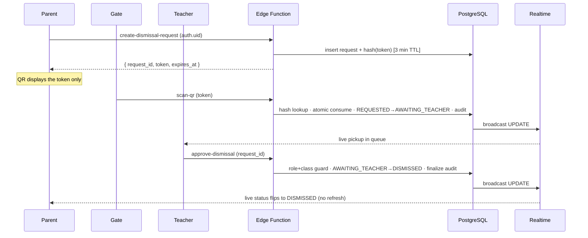

# DismissFlow — EPS

**Web-based school e-dismissal & digital pickup system**
*Prototype: Nursery / Tulip · 18 students · 2-developer team*

DismissFlow replaces manual, card-based student dismissal with a secure digital chain:

**Parent Request → QR Verification → Teacher Confirmation → Dismissed**

A parent requests pickup from their phone and gets a short-lived, single-use QR code. Gate staff scans it with a browser camera; the backend validates it and instantly pushes the request to the responsible teacher's live queue. The teacher makes the final approve/reject call, and the parent sees the result in real time — no refresh, no paper, no pickup cards.

---

## Why this exists

Manual dismissal relies on visual recognition, verbal hand-offs, and paper logs. That creates queues, miscommunication, and weak auditability — it is hard to prove *who* authorized a release. DismissFlow builds a clear, traceable digital chain that is safer, faster, and cardless, while staying small enough for a two-person team to build end to end.

The prototype deliberately demonstrates a **digital dismissal module**, not a full PTS replacement. The data model is designed so it can later drop into an existing school PTS rather than replace it.

---

## What we are building

One responsive **Next.js** web app delivering four role-specific experiences, all backed by a single realtime **Supabase** system:

| Portal | Who | What it does |
| ------ | --- | ------------ |
| **Parent** | Guardian | Requests pickup for their linked child, displays the QR, watches live dismissal status, can cancel an active request, views history. |
| **Gate / Scanner** | Gate staff | Authenticates the shared gate device, scans the parent QR with a browser camera, sees only minimum verification info. |
| **Teacher** | Teacher | Views a realtime pickup queue for their class and makes the final approve/reject decision. |
| **Admin** | Admin | Reviews the roster, dismissal counts, and the immutable audit log. |

The product is **web-first** (no app install) and **realtime-first** — state propagates over Supabase Realtime; polling and manual refresh are explicitly forbidden.

---

## Architecture at a glance

```
Browser (responsive web app)
  Parent · Gate · Teacher · Admin  ──▶  Supabase
                                          ├─ Auth (JWT)
                                          ├─ PostgreSQL + Row Level Security
                                          ├─ Realtime (postgres_changes)
                                          └─ Edge Functions (server-trusted logic)
```

The **security boundary is the whole point**: the browser is never the authority. The client only renders the QR, decodes a scan, and sends tokens/actions. All QR validation, authorization, state transitions, single-use/expiry enforcement, and audit logging happen **server-side** in Edge Functions and PostgreSQL. The QR encodes *only* a random, server-issued token — no student or guardian PII ever lives in it.

### End-to-end flow



The full architecture — state machine, QR security lifecycle, RLS scopes, realtime flows, and the implementation blueprint — lives in [`Docs/architecture.md`](Docs/architecture.md).

---

## Status

| Area | Status |
| --- | --- |
| Supabase schema (8 tables, RLS, partial unique index) | shipped |
| Edge Functions: `create-dismissal-request`, `scan-qr`, `approve-dismissal`, `reject-dismissal`, `cancel-dismissal` | shipped |
| Atomic RPCs: `consume_qr_scan`, `teacher_decide_request`, `parent_cancel_request` | shipped |
| Tulip roster seed (18 students, 36 guardians, 18 links) | shipped |
| Demo identity provisioning script (real Supabase Auth, no hardcoded creds) | shipped |
| **Parent portal** (live status, cancel, history, profile) | shipped |
| **Gate portal** (camera scanner via BarcodeDetector, manual entry fallback) | shipped |
| **Teacher portal** (live queue, pickup detail, approve / reject) | shipped |
| **Admin portal** (overview, roster, audit log) | shipped |
| Realtime subscriptions (`postgres_changes` with RLS-filtered payloads) | shipped |
| Unit tests (shared contract + crypto) | 47/47 passing |
| Architecture doc updated to reflect current implementation | in progress |

---

## Design direction

**Revora structure + Kernel motion + soft kernel-blue accent.** Dark, technical, command-deck feel — not a child app, not AI slop. Revora gives the editorial mono metadata, hairline 1px borders, and capability-grid layout; Kernel Agent gives the Framer Motion reveals, Lenis smooth scroll, cursor glow, and bento card motion. Tokens and patterns are documented in [`Docs/design/README.md`](Docs/design/README.md).

---

## Repository layout

```
DismissFlow-EPS/
├── Docs/
│   ├── PRD.md                       # Product requirements (source of truth)
│   ├── architecture.md              # Architecture specification
│   └── design/                      # Design system docs
├── app/                             # Next.js App Router
│   ├── layout.tsx                   # Root layout, fonts, smooth scroll, cursor glow
│   ├── globals.css                  # Design tokens (CSS) + motion utilities
│   ├── page.tsx                     # Landing / role selection
│   ├── login/                       # Parent + role-aware sign-in
│   ├── parent/                      # Parent portal (dashboard / history / profile)
│   ├── gate/                        # Gate portal (scanner)
│   ├── teacher/                     # Teacher portal (queue / [requestId])
│   └── admin/                       # Admin portal (overview / roster / logs)
├── components/
│   ├── effects/                     # CursorGlow, SmoothScroll (Lenis)
│   └── ui/                          # Panel, MonoLabel, StatusPill, StatusIndicator, TopNav, Icon, PrimaryButton
├── lib/
│   ├── supabase/                    # Browser + server clients (anon key only)
│   ├── auth/                        # Session / role guards / sign-in helpers
│   ├── dismissal/                   # State types + typed Edge Function wrappers
│   ├── qr/                          # Server-side token crypto + browser QR render + camera scan
│   └── realtime/                    # useRealtimeStatus / useTableChanges hooks
├── supabase/
│   ├── migrations/                  # 0001_init → 0008_cancel_request
│   └── functions/                   # create-dismissal-request, scan-qr, approve/reject/cancel-dismissal
├── scripts/
│   └── provision-demo-identities.mjs
├── middleware.ts                    # Session-refresh middleware (no service-role)
├── tailwind.config.ts
├── next.config.js
├── package.json
└── README.md
```

---

## Tech stack

- **Frontend:** Next.js (App Router) + TypeScript, Tailwind CSS, Framer Motion, Lenis
- **Backend (all of it):** Supabase — Auth, PostgreSQL, RLS, Realtime, Edge Functions
- **Hosting:** Vercel (web app) + Supabase (backend), GitHub for source and CI

No separate Node server. No native client for the prototype.

---

## Getting started

```bash
cd DismissFlow-EPS
npm install --include=dev
npm run dev
```

The home page renders without env vars. To wire it to a real Supabase project, copy `.env.example` to `.env.local` and fill in `NEXT_PUBLIC_SUPABASE_URL` and `NEXT_PUBLIC_SUPABASE_ANON_KEY`.

### Verification

```bash
npm test              # 47/47 contract + crypto tests
npm run typecheck     # tsc --noEmit
npm run build         # Next.js production build
```

### Demo identity provisioning

The database schema and Edge Functions are complete, but there are no Auth users
or `public.users` profiles yet. Run the provisioning script once to create the
demo identities (real Supabase Auth accounts, no hardcoded credentials):

```bash
SUPABASE_URL=https://<project>.supabase.co \
SUPABASE_SERVICE_ROLE_KEY=<server-only-secret> \
NEXT_PUBLIC_DEMO_EMAIL_DOMAIN=demo.dismissflow \
DEMO_TEACHER_PASSWORD=... DEMO_GATE_PASSWORD=... DEMO_ADMIN_PASSWORD=... \
npm run provision
```

- **Parents** are created from the live `students` table (one parent per student,
  linked to that student). No student data is hardcoded.
- **Teacher** is assigned to the Tulip class (`classes.teacher_id` is set).
- **Gate** and **Admin** accounts are created with `role = gate` / `role = admin`.
- If `DEMO_*_PASSWORD` is omitted, a random password is generated and printed.

Parent login uses the PRD §12 demo shortcut: the **admission number is both the
identifier and the password** (the Auth email is `<admission>@<demo-domain>`).

---

## Dismissal state machine (simplified for the prototype)

```
IDLE → REQUESTED → AWAITING_TEACHER → DISMISSED
                                  ↘ REJECTED
REQUESTED / AWAITING_TEACHER → EXPIRED
REQUESTED → CANCELLED
```

A valid gate scan is recorded as an **event** (not a separate persisted state); teacher approval transitions directly to `DISMISSED`, with `approval_time` captured in the audit log. A parent can cancel only while the request is in `REQUESTED`; once the gate has scanned (`AWAITING_TEACHER`), the teacher is in the loop and the parent cannot unilaterally cancel. The full transitions and failure behavior are in `Docs/architecture.md` §7.

---

## License

See [LICENSE](LICENSE).
